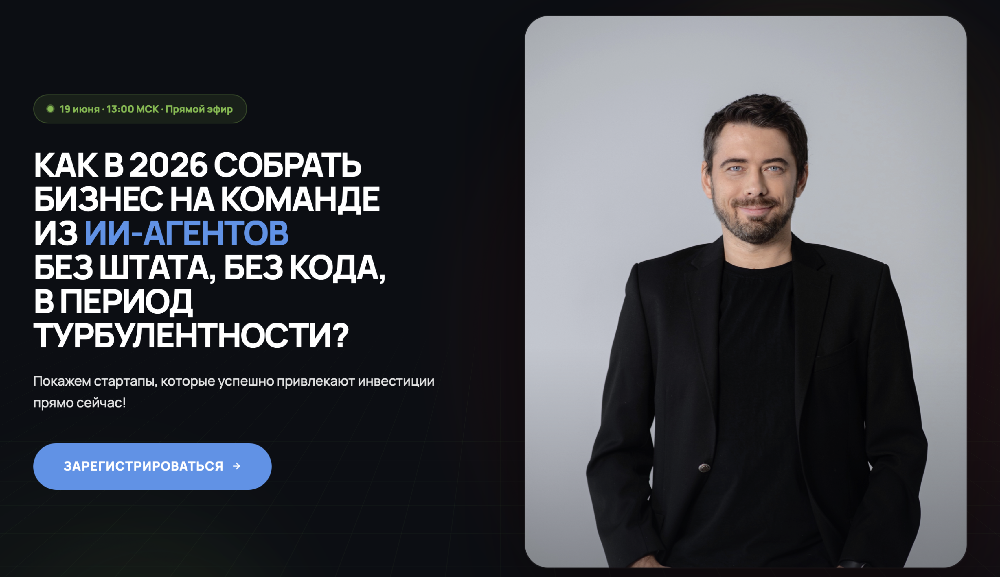
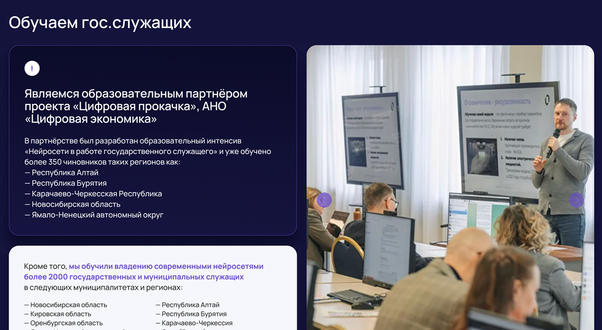
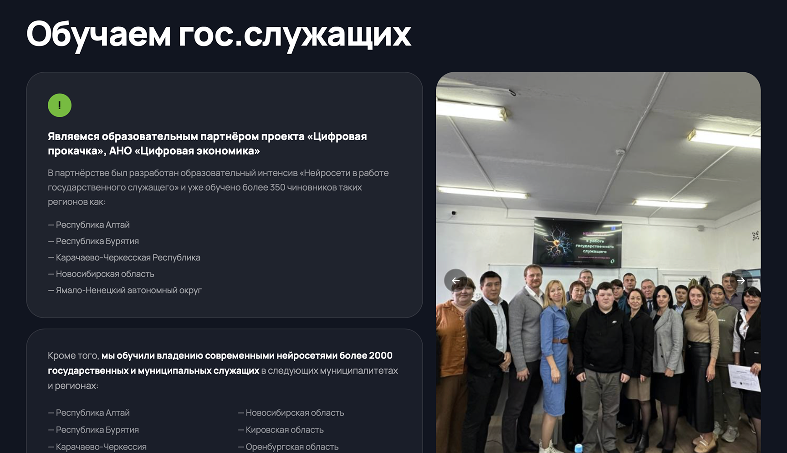
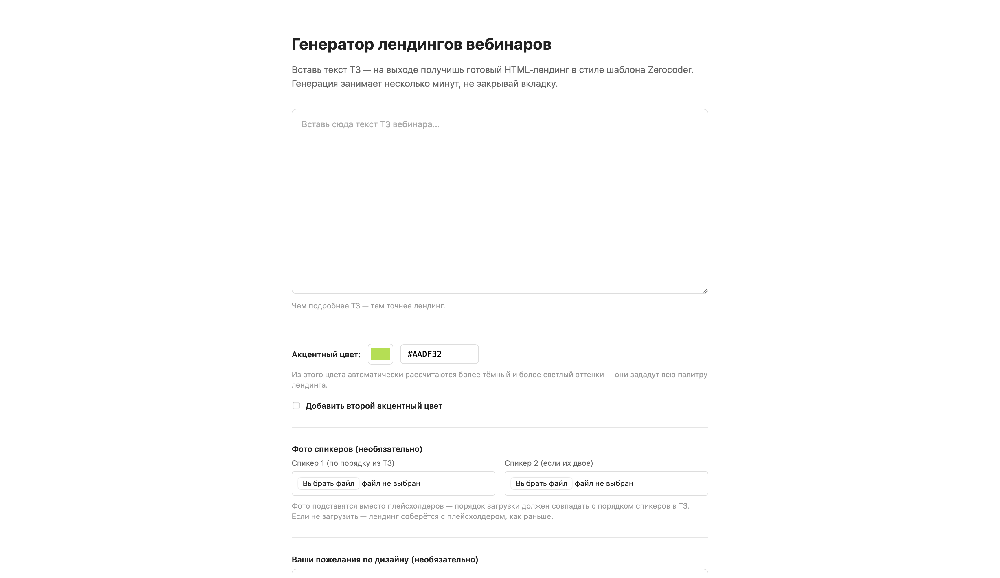
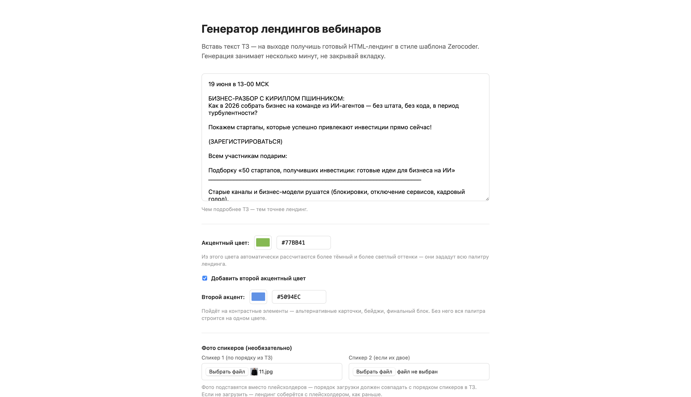
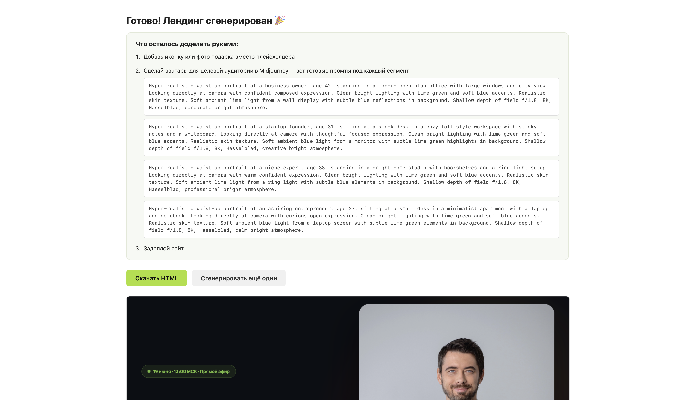
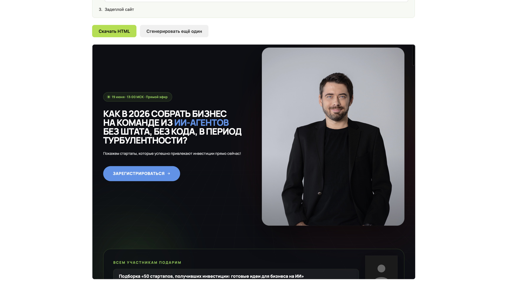

# Landing Generator MVP

Сервис для быстрой генерации лендингов вебинаров **Zerocoder** из текста ТЗ. Загружаешь ТЗ — на выходе готовая HTML-страница в фирменном стиле, без ручной вёрстки.



## Главное преимущество

Блоки собираются не из произвольных моделью сгенерированных кусков, а из шаблона, который воспроизводит структуру и оформление, привычные по существующим лендингам Zerocoder. Например, блок «О нас» выглядит и собирается именно так, как он выглядит на других реальных лендингах компании — с теми же логотипами партнёров, наградами, СМИ и т.д. Это не "лендинг, сгенерированный нейросетью", а лендинг в уже узнаваемом фирменном стиле, просто собранный быстрее.

| Блок «О нас» на другом лендинге Zerocoder | Тот же блок на сгенерированном лендинге |
|---|---|
|  |  |

## Когда это нужно

В компании приняли решение делать лендинги на Tilda — это остаётся основным способом. Генератор существует на случай очень горящих сроков: когда нужно запустить вебинар максимально срочно, а собирать лендинг руками в Tilda уже некогда — тогда можно за пару минут получить готовую страницу через генератор.

## Как это работает

Форма выглядит так — вставляешь ТЗ, выбираешь акцент и при желании настраиваешь детали:




Архитектура — двухшаговая, чтобы результат был предсказуемым, а не "что нагенерила модель":

1. **Извлечение данных.** Текст ТЗ отправляется в Claude Code (`claude -p ...`, модель Sonnet) с промптом, который просит вернуть строго структурированный JSON: заголовок, спикеров, программу эфира, подарки, тарифы, аудиторию, глоссарий и т.д. Модель ничего не придумывает — только вытаскивает то, что явно есть в тексте.
2. **Сборка HTML.** Дальше включается чистый Python: JSON-данные подставляются в заранее свёрстанный шаблон (`templates/landing-template.html`). Никакой генерации вёрстки моделью — структура и стили детерминированы и проверены.

Модель используется ещё в двух местах, тоже точечно:

- **Пожелания по дизайну** (необязательное поле в форме) — короткий запрос к модели генерирует дополнительный CSS поверх шаблона (только типографика и декоративные свойства; layout трогать запрещено промптом). Особые случаи — смена темы целиком или формы углов по всему сайту — модель не пытается закрыть точечным CSS (получился бы разнобой), а просто сигнализирует код-уровню (`corners: "sharp"/"soft"`), который применяет изменение системно через CSS-переменные шаблона.
- **Промпты для аватаров спикеров** — если в ТЗ не приложены фото, генератор готовит текстовые промпты для Midjourney/ChatGPT под подобранную цветовую палитру лендинга.

## Возможности

- Генерация полного лендинга по тексту ТЗ одним кликом
- Настройка акцентного цвета (и второго акцентного — опционально)
- Загрузка фото спикеров (до двух) с автосохранением в папку лендинга
- Свободные пожелания по дизайну на естественном языке (шрифт, акценты, форма углов и т.д.)
- Автоматический подбор размера заголовка под длину текста (чтобы длинные заголовки не разъезжались на 6-7 строк)
- Типографическая склейка коротких предлогов/союзов неразрывным пробелом — без висящих предлогов в тексте
- Промты для MJ для генерации фотографий ЦА в цветах сайта
- Чек-лист после генерации: что проверить и доделать руками (фото, виджеты на оплату и т.д.)

## Структура проекта

```
landing-generator-mvp/
├── app.py                     # вся логика: Flask-сервер, промпты, сборка HTML
├── requirements.txt           # зависимости (Flask)
├── templates/
│   ├── index.html             # форма ввода ТЗ
│   ├── result.html            # страница с результатом и чек-листом
│   └── landing-template.html  # параметризованный шаблон лендинга
├── shared-assets/             # общие изображения (логотипы, иконки, плейсхолдеры)
├── generated/                 # сюда сохраняются готовые лендинги (в .gitignore — содержат клиентские данные)
└── запустить-генератор.command # запуск сервиса одним кликом на macOS
```

## Запуск

Понадобится Python 3 и [Claude Code CLI](https://docs.claude.com/claude-code) (используется как `claude` в PATH — через него идёт извлечение данных и генерация CSS/промптов).

```bash
pip install -r requirements.txt
python3 app.py
```

Сервис поднимется на `http://localhost:5050`. На macOS можно запускать двойным кликом по `запустить-генератор.command` — он сам стартует сервер и открывает форму в браузере.

## Как пользоваться

1. Открыть форму, вставить текст ТЗ вебинара
2. Указать акцентный цвет (HEX), при желании — второй акцентный цвет
3. По желанию — загрузить фото спикеров и описать пожелания по дизайну текстом
4. Нажать «Сгенерировать» — через несколько секунд появится ссылка на готовый лендинг и чек-лист для финальной доводки руками




Готовые лендинги сохраняются в `generated/landing-<дата-время>-<slug>/index.html` и сразу доступны для просмотра по ссылке `/preview/...`.

## Статус

MVP. Сервис закрывает основной сценарий — от ТЗ до готового лендинга за один проход. Дальнейшие доработки опираются на обратную связь по реальным запускам.
